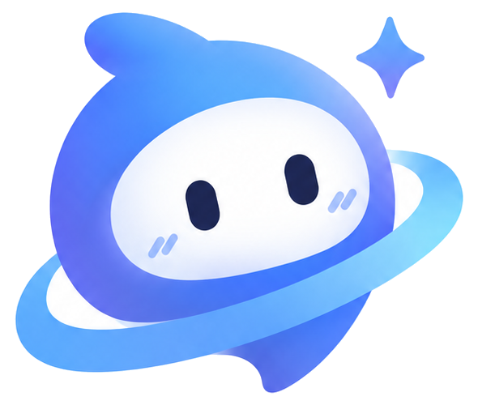

<div align="center">
  

  <h1>Olai 创作空间</h1>
  <p><strong>从一句灵感，开始对话、绘图、作曲与视频创作。</strong></p>
  <p>让蓝紫色星球伙伴「小o」陪你，把想法变成作品。</p>

  <p>
    
    
    
    
  </p>

  <p>
    <a href="#功能概览">功能概览</a> ·
    <a href="#快速开始">快速开始</a> ·
    <a href="#环境配置">环境配置</a> ·
    <a href="#部署指南">部署指南</a> ·
    <a href="#开发与验证">开发与验证</a>
  </p>
</div>

> **项目状态：持续开发中。** 当前仍有待修复的问题；生成能力取决于上游服务支持，重要作品请及时下载备份。

## 功能概览

Olai 将 AI 对话与媒体创作放在同一个工作台。首页直接进入对话，点击输入框下方的「+」即可选择图片、音乐或视频；描述、参数和生成结果都在当前对话中完成。

| 创作方式 | 可以做什么 |
| --- | --- |
| 💬 AI 对话 | 在统一界面中交流想法，随时切换创作模式 |
| 🎨 图片创作 | 设置比例、画质与联想等级，查看原始图片的实际尺寸 |
| 🎵 音乐创作 | 整理灵感、编辑歌曲段落、生成封面、校准歌词，导出 TXT / LRC |
| 🎬 视频创作 | 设置时长、比例与画质，播放、下载并保存生成的视频 |
| 🗂️ 作品库 | 收藏创作结果，从已有歌曲继续编辑并生成新版本 |
| ☁️ 账号同步 | 登录后同步游客记录，在其他设备读取账号作品 |

侧边栏保留「AI 对话」和「作品库」。原 `/home`、`#home` 入口兼容为对话页，媒体路径直接打开对应创作模式。用户界面隐藏模型名称，默认使用指定创作引擎。

### 小o与交互体验

品牌插画和字标位于 [`public/brand`](public/brand)，保留原始品牌形象；小尺寸标识和 favicon 为 SVG。待机小o使用原图底层和独立 SVG 眼睛，随机眨眼、平滑跟随鼠标，离开窗口后回正；减少动态效果时关闭这些动作，触摸设备不追踪视线。

品牌样式集中在 [`src/styles/brand.css`](src/styles/brand.css)，公共弹窗和更多菜单位于 [`src/components/ui`](src/components/ui)，支持键盘操作、焦点恢复及减少动态效果偏好。确认删除与会话重命名使用站内弹窗。

创作参数使用右侧边栏，由对话区右上角的侧栏按钮控制展开和收起，并保留参数与本次访问的展开偏好。桌面展开时主内容与输入框一起缩窄，参数独立滚动；窄屏默认收起，展开为右侧抽屉，支持点击遮罩或按 Escape 关闭。进入歌曲段落编辑时自动展开，参数校验提示在结果区域显示。

## 快速开始

### 1. 安装依赖

使用 Node.js 22.9 或更新版本。

```bash
npm install
```

### 2. 配置服务

将 [`.env.example`](.env.example) 复制为 `.env`，填写上游服务地址与可选的服务端密钥。也可以在界面中填写 API Key。

```dotenv
AI_API_BASE_URL=https://ai.bllii.com/v1
AI_API_KEY=你的上游服务密钥
```

默认配置为 web2api 在线版本（v0.3.0）。上游地址只能由部署者配置；模型目录可读，也不代表账号拥有生成额度。

### 3. 启动开发服务器

```bash
npm run dev
```

打开 [http://localhost:4321](http://localhost:4321)，开始对话或选择创作模式。

> 开发数据库会在开发服务器重启时重建。需要持久保存账号和作品时，请使用下方的[部署流程](#部署指南)。

## 创作说明

### 音乐与歌曲编辑

音乐支持 Composer 段落编辑和灵感整理，两种模式共享歌曲结构。灵感模式每次读取当前描述与风格；Composer 使用最新编辑的歌词和编曲，修改下方灵感后会重新整理歌曲。

完成的作品和作品库中均可点击「编辑后生成」载入歌曲，修改后保存为新作品，保留原版本。游客的歌词、编曲结构和音频关联保存在当前浏览器，登录后保存在账号数据库中，支持 TXT 和 LRC 导出。纯音乐不会生成歌词文件。

### 可选封面与旧作品补图

音乐参数中可勾选「生成封面」，默认关闭。勾选后，在音频完成时调用 Nanobanana 2.1，根据歌曲名称、风格、主题与歌词生成 1:1 封面，与歌曲关联保存，并显示在作品卡片、唱片和迷你播放器中。

支持单独下载封面，下载作品时也会包含封面；封面失败不影响音频，可单独重试。编辑旧作品会恢复原封面选项，新版本生成对应的新封面。

没有封面的已完成音乐作品提供「生成封面」按钮，创作结果与作品库都可直接补图。旧版本没有保存歌曲段落的作品，也会根据原描述生成封面。补图只更新原作品的封面，保留音频、歌词和时间轴。

### 歌词导出与校准

初始 LRC 按实际音频时长估算，不能保证与演唱对齐。在作品卡片或播放器点击「校准歌词」，会把实际音频（转换为单声道 WAV）和逐句歌词提交给默认 3.8 文本引擎，通过 `input_audio` 获取开始与结束时间，保留前奏和间奏留白。

服务需要支持音频输入和理解；只校验结果的完整性与时间范围，实际同步效果需试听检查。成功后同步更新播放器、下载文件及本地保存；失败保留已有时间轴并显示原因。

### 图片尺寸与画质

图片默认 **Auto 比例 / 1K 画质 / Medium 联想**，支持主流比例、自定义正数比例及 1K / 2K / 4K。默认聊天兼容模式将画质写入提示词，无法保证精确控制；原生分辨率控制见[上游接口与模型](#上游接口与模型)。

图片作品显示原始文件的实际宽高，并保存到作品记录；旧作品在预览载入后也会显示实际尺寸。若返回图片的长边未达到目标分辨率（1K：1024、2K：2048、4K：至少 3840，兼容 3840 和 4096），卡片和生成完成提示会说明未达标。图片读取失败不影响保存或下载，不会将图片拉伸成 4K。

### 视频创作

默认使用 **Omni 1.1 Flash**，参数提供 16:9 / 9:16、3–10 秒滑块（步长 1 秒）与 720p / 1080p / 4K，默认 **4 秒 / 720p**。时长、比例和画质属于创作偏好，不保证精确控制，选择 4K 不保证输出 4K。

视频按 MIME 保存原始文件，可播放、下载并收入作品库。聊天响应只有文字时，界面提示未收到视频文件。配置 `veo-*` 模型时使用独立任务接口，保留 4–15 秒参数选择；两种路由共用视频生成额度。具体协议见[上游接口与模型](#上游接口与模型)。

## 账号与生成额度

### 注册与登录

点击侧边栏或顶部的「登录 / 注册」，可使用邮箱和 **8–128 位密码**注册，注册后自动登录。

密码使用 scrypt 加盐散列，登录凭证通过 HttpOnly / SameSite Cookie 保存，数据库仅保存凭证散列，有效期 30 天。本站暂未提供邮件验证和密码重置。退出登录会撤销当前登录凭证。

### 本地保存与账号同步

默认继续使用浏览器 IndexedDB（不支持时使用 localStorage）。登录或注册成功后，自动将当前浏览器尚未关联账号的游客会话、作品、音频/视频、歌曲结构、封面和歌词在后台同步并关联到当前账号。

先载入账号记录并开放工作台，同步不会阻塞新建对话和其他操作。已登录的页面刷新时也会补同步未完成的游客记录。

每条记录上传成功后才标记本地归属，原始本地副本保留作为备份；已关联的记录不再显示为游客记录，也不会同步给之后登录的其他账号。

重复导入不会产生重复记录或覆盖云端已有修改；单条同步失败会继续处理后续记录，未完成的内容保留在本地；工作台和账号窗口均可重试同步并查看错误。

上传超时为 60 秒；每条云端记录的 JSON 上限为 64 MB（包含媒体 Base64），超大记录会在上传前提示大小限制。大记录分块保存并原子更新。

退出后可继续创建新的游客记录。**API Key 和创作偏好仍只保存在浏览器。** 账号记录接口逐次验证登录身份和记录归属；账号过期或云端保存失败时会提示错误，请下载重要内容备份。

### 每日生成额度

| 身份 | 默认额度 | 计算方式 |
| --- | --- | --- |
| 游客 | 每种类型每天 1 次 | 按 IP |
| 登录用户 | 每种类型每天 15 次 | 按账号 |

图片、音乐、视频分别计算每日生成额度，按**北京时间零点**重置。

普通对话、歌曲文本整理、歌词校准及视频轮询/下载不计次数。**歌曲封面计入图片额度。**

额度由服务端数据库原子预占；已经提交的生成请求计一次，失败、停止和重试也会使用次数。同一类型的原生聊天生成与专用媒体接口共用额度，客户端自带 API Key 同样受限制。

次数必须为非负整数，`0` 禁用对应身份的媒体生成；修改后重启服务。登录 / 注册接口另有每 IP 每 15 分钟 20 次的保护。

## 环境配置

完整示例见 [`.env.example`](.env.example)。构建按 Astro 规则加载环境文件；启动通过 Node 自带的环境文件功能加载 `.env` 和 `.env.production`（后者优先），部署平台已提供的变量优先。数据库连接在运行时读取，已移除应用的 dotenv 依赖。

| 环境变量 | 默认值 / 行为 | 用途 |
| --- | --- | --- |
| `AI_API_BASE_URL` | `https://ai.bllii.com/v1` | 上游 OpenAI 兼容接口地址；默认配置为 web2api 在线版本 |
| `AI_API_KEY` | 可选 | 服务端 API Key，也可在界面中填写密钥 |
| `AI_CHAT_MODEL` | `gemini-3.5-flash` | 对话引擎在网关中的实际别名 |
| `AI_IMAGE_MODEL` | `gemini-3.1-flash-image` | 图片引擎在网关中的实际别名 |
| `AI_IMAGE_API_MODE` | `auto` | 图片接口模式；web2api 通过 chat 接口返回 Markdown 图片 |
| `AI_VIDEO_MODEL` | `veo-3.1-lite-generate-preview` | 视频引擎；veo 使用 /v1/videos 异步任务接口 |
| `AI_MUSIC_MODEL` | `lyria-3.5` | 音乐引擎在网关中的实际别名；通过 chat 接口返回音频 |
| `GUEST_DAILY_GENERATION_LIMIT` | `1` | 每个游客 IP、每种生成类型的每日次数 |
| `USER_DAILY_GENERATION_LIMIT` | `15` | 每个登录账号、每种生成类型的每日次数 |
| `DATABASE_URL` | 生产默认 `data/olai.db` | 本地文件路径、`file:` URL 或远程 libSQL 地址 |
| `DATABASE_AUTH_TOKEN` | 本地无需配置 | 远程数据库提供的访问令牌 |
| `ASTRO_DB_REMOTE_URL` / `ASTRO_DB_APP_TOKEN` | 兼容旧部署 | 未配置新的对应变量时继续读取旧变量 |
| `HOST` | `0.0.0.0` | 服务监听地址 |
| `PORT` | `4321` | 服务监听端口 |
| `SITE_ORIGIN` | 本地访问无需设置 | 反向代理部署时的公开站点 origin |
| `TRUST_PROXY` | `false` | 是否信任代理提供的客户端 IP |

若网关使用不同的模型 ID，可通过上述模型变量配置同一引擎的实际别名。模型列表刷新不会自动更换创作引擎。

## 部署指南

### 本地持久化数据库

```bash
npm run build
npm start
```

数据库环境变量可全部留空。`npm start` 直接启动 `dist/server/entry.mjs`，服务在首次接口请求时自动创建 `data/olai.db` 及所需表，持久保存账号、会话和额度；`npm run preview` 使用相同启动入口。构建不连接数据库，数据库地址仅在运行时读取，修改地址后重启即可。

需要指定文件时，设置 `DATABASE_URL=data/olai.db`，普通路径和 `file:./data/olai.db` 均可。本地数据库不需要令牌。旧 `ASTRO_DB_REMOTE_URL` / `ASTRO_DB_APP_TOKEN` 配置继续兼容，本地令牌会被忽略；已有 Astro DB 文件直接沿用，自动初始化只添加缺少的表和索引，不删除账号或作品。

部署时保留 `data` 目录并提供写入权限，容器部署将其挂载到持久化卷。服务默认监听 4321 端口，可通过 `HOST`、`PORT` 配置。

### 远程 libSQL / Turso

在 `.env` 或部署平台设置远程连接：

```dotenv
DATABASE_URL=libsql://your-db.turso.io
DATABASE_AUTH_TOKEN=数据库提供的访问令牌
```

使用相同构建和启动命令：

```bash
npm run build
npm start
```

服务自动初始化表。数据库直接通过 libSQL 客户端和 Drizzle 访问，已移除 Astro DB 集成。表定义位于 [`db/schema.ts`](db/schema.ts)，兼容现有数据库的初始化 SQL 位于 [`db/runtime.mjs`](db/runtime.mjs)。

### 开发与生产数据库

| 运行方式 | 数据库 | 持久化行为 |
| --- | --- | --- |
| `npm run dev` | `.astro/olai-dev.db` | 开发重启保留记录，与默认生产数据库分开 |
| `npm run build` + `npm start` | `data/olai.db` | 重启、重新构建保留记录 |
| 远程数据库部署 | 配置的 libSQL 数据库 | 由远程数据库持久保存 |

配置了数据库地址时，开发和生产均使用该地址。请从项目根目录启动服务，相对数据库路径以启动目录为准。部署需要 Node 服务及生产依赖；仅部署 `dist/client` 静态目录无法运行账号与生成接口。

### Docker 部署

仓库提供 [`Dockerfile`](Dockerfile)，构建阶段安装构建依赖，运行阶段单独安装生产依赖和当前 Linux 平台的 SQLite 原生驱动：

```bash
docker build -t olai .
docker run -d --name olai -p 4321:4321 --env-file .env -v olai-data:/app/data olai
```

`.env` 中配置公开站点的 `SITE_ORIGIN` 和上游服务。数据库默认使用持久化卷内的 `/app/data/olai.db`。镜像不包含本地 `.env`、数据库或 Windows 的 `node_modules`。

使用自己的容器构建流程时，运行镜像也需要 `package.json` 和在该镜像内安装的生产依赖：

```bash
npm install --omit=dev --include=optional
```

只从构建阶段复制 `dist` 会遗漏 SQLite 驱动和其他外部依赖。构建产物已内置 Drizzle，环境文件由 Node 原生读取，原生 SQLite 驱动仍由生产依赖提供。

### 反向代理与来源校验

本地访问无需设置 `SITE_ORIGIN`，服务按请求的实际 Host（含端口）与协议校验 Origin，支持 `localhost:4321`、`127.0.0.1:4321` 和局域网地址，拒绝不同来源。

通过反向代理部署时，设置 `SITE_ORIGIN` 为公开站点的完整 origin，不含路径和末尾斜杠（例如 `https://olai.example.com`）。

仅当可信代理覆盖 `X-Forwarded-For`、且外部不能直接连接应用时，启用 `TRUST_PROXY=true`。默认拒绝带有未受信任转发 IP 标头的游客生成及登录请求，避免伪造 IP 改变额度。

## 上游接口与模型

接入依据：[web2api 文档](https://ai.bllii.com/v1/docs)，适配版本 v0.3.0。默认服务地址为 `https://ai.bllii.com/v1`，使用 Bearer API Key；连接时读取实际模型目录，目录可用不代表账户有生成额度。

**当前配置说明：**
- **对话**：`gemini-3.5-flash` 或 `gemini-flash-latest` 通过 /v1/chat/completions
- **图片**：`gemini-3.1-flash-image` 通过 /v1/chat/completions，响应中包含 Markdown 格式的 Base64 图片，支持 `image_size: 1K/2K/4K` 和 `max_tokens >= 2048`
- **视频**：`veo-3.1-lite-generate-preview` 通过 /v1/videos 异步任务接口，支持 `size` 和 `seconds` 参数，4K 需要 8 秒
- **音乐**：`lyria-3.5`（约 62 秒）、`lyria-3-pro-preview`（约 62 秒）、`lyria-3-clip-preview`（约 30 秒）通过 /v1/chat/completions，响应中包含 Markdown 格式的 MP3 音频 ``

<details>
<summary><strong>图片生成：chat/completions 接口</strong></summary>

图片使用 `POST /v1/chat/completions` 非流式 JSON，发送 `model`、`messages`、`stream: false`，以及顶层参数 `image_size`（"1K"/"2K"/"4K"）和 `max_tokens`（≥2048，4K 建议 8192）。

响应的 `choices[].message.content` 包含 Markdown 格式的 Base64 图片，例如 ``。比例和联想等级写入提示词，属于创作偏好。

web2api v0.3.0 的 /v1/images/generations 接口当前返回 502，不可用。

</details>


<details>
<summary><strong>视频生成：Veo 任务接口与 Omni 聊天接口</strong></summary>

**Veo 模式**（默认 `veo-3.1-lite-generate-preview`）：
- 使用 `POST /v1/videos`、`GET /v1/videos/{id}` 和携带鉴权的 `GET /v1/videos/{id}/content`
- 发送 `model`、`prompt`、`size`（`848x480` 或 `480x848`）、`seconds`（4-8 秒）
- 4K 视频需要 8 秒时长
- 下载返回 409 时继续等待，失败任务停止查询

**Omni 模式**（`gemini-omni-*` 模型）：
- 通过 `POST /v1/chat/completions` 转发
- 仅发送 `model`、`messages`、`stream: false`、`resolution`
- 在提示词中要求生成视频，写入时长、比例、画质
- 读取 `choices[].message` 中的视频链接、Markdown/data URI 或视频内容数组
- 聊天响应只有文字时提示未收到视频文件

Omni 与 Veo 两种路由共用视频生成额度。上游视频服务返回 HTML 错误页时，本站转为 JSON 错误。

</details>

<details>
<summary><strong>音乐生成：chat/completions 接口</strong></summary>

音乐使用 `POST /v1/chat/completions` 非流式 JSON，发送 `model`、`messages`、`stream: false`。

支持的模型：
- `lyria-3.5`（约 62 秒）
- `lyria-3-pro-preview`（约 62 秒）
- `lyria-3-clip-preview`（约 30 秒）

响应的 `choices[].message.content` 包含 Markdown 格式的 MP3 音频，例如 ``。解码后为标准 MP3 文件。

歌曲结构、歌词和风格写入提示词。歌曲整理通过系统提示要求 JSON，再校验完整段落结构。

</details>

## 开发与验证

### 常用命令

| 命令 | 用途 |
| --- | --- |
| `npm run dev` | 启动开发服务器 |
| `npm run check` | Astro / TypeScript 检查 |
| `npm test` | 运行单元测试 |
| `npm run build` | 构建，不连接数据库 |
| `npm start` / `npm run preview` | 直接启动 Node 构建产物，接口自动初始化数据库 |

基础验证：

```bash
npm test
npm run build
```

### 浏览器检查

浏览器检查需要 Playwright Chromium，首次使用可运行：

```bash
npx playwright install chromium
```

| 命令 | 主要覆盖内容 | 截图目录 |
| --- | --- | --- |
| `node scripts/verify-studio.mjs` | 音乐编辑与保存、歌词下载、默认引擎、媒体参数、隐藏模型名称、移动端布局 | `.qa` |
| `node scripts/verify-brand.mjs` | 桌面 / 手机 / 平板布局、SVG ID、菜单键盘操作、重命名与删除弹窗、焦点与滚动恢复、对话、减少动态效果 | `.qa/brand` |
| `node scripts/verify-music.mjs` | 连续灵感生成、段落编辑与新灵感覆盖、音频校准请求、播放器更新、失败回退、LRC 下载与持久化、封面生成 / 重试 / 显示 / 下载、作品库编辑、手机布局 | `.qa/music` |

三个 `scripts/verify-*.mjs` 检查需先启动开发服务器，可用 `STUDIO_URL` 指定地址。工作台与品牌检查默认使用端口 4322，音乐检查默认使用端口 4323。使用默认开发端口 4321 时，PowerShell 示例：

```powershell
$env:STUDIO_URL = "http://localhost:4321"
node scripts/verify-studio.mjs
node scripts/verify-brand.mjs
node scripts/verify-music.mjs
```

### 项目结构

```text
.
├── db/schema.ts             # 账号、记录与额度的 Drizzle 表定义
├── db/runtime.mjs           # 运行时数据库配置与自动建表
├── Dockerfile               # 构建并安装运行镜像的生产依赖
├── public/brand/            # 小o插画与品牌字标
├── scripts/                 # 品牌资源处理、工作台与音乐浏览器检查
├── src/
│   ├── components/          # 对话、媒体创作、作品库、播放器与弹窗
│   ├── lib/                 # 创作逻辑、本地保存、账号与上游服务
│   ├── pages/api/           # AI 转发、账号与记录接口
│   ├── middleware.ts        # API 错误处理
│   └── styles/              # 全局与品牌样式
└── .env.example             # 环境配置示例
```

## 常见问题

### 登录接口返回 HTML，而不是 JSON

`GET /api/auth/me` 应返回 `application/json`。未登录时返回 `{"user":null,"generationLimit":1}`（次数取自环境配置）。出现包含「请启用 JavaScript 以使用 Olai」的 HTML 表示接口落入页面或服务器错误页；请确保 `/api/*` 转发到 Node 服务，而不是静态首页。API 中间件会将应用初始化错误转换为 JSON，具体异常输出到服务端日志。

### 服务初始化失败

日志出现 `ERR_MODULE_NOT_FOUND` / `Cannot find package` 表示运行镜像缺少依赖，接口模块尚未执行。使用仓库 Dockerfile，或在运行镜像中执行 `npm install --omit=dev --include=optional`；原生 SQLite 驱动需要与服务器的操作系统和架构匹配。接口会用 `DEPENDENCY_MISSING` 区分此问题。

本地数据库无需远程地址或访问令牌，首次接口请求自动创建 `data/olai.db` 和表。检查服务日志中的文件权限或连接错误，确保启动目录正确、数据库及其所在目录可写；容器部署需要保留持久化卷。修改数据库环境变量后重启即可，不需要重新构建。数据库初始化失败时，接口返回 JSON 错误，服务端日志记录具体原因。

### 选择 4K 后，实际输出没有达到 4K

默认聊天兼容协议将画质作为提示词偏好，无法保证精确输出。图片可在上游启用官方后端后使用 `interactions` 模式；视频输出仍取决于上游模型支持。

### 开发服务器重启后，账号记录消失

默认开发数据库为 `.astro/olai-dev.db`，重启不会清空；删除 `.astro` 会删除该开发文件。生产运行 `npm run build` 和 `npm start`，并保留 `data` 目录，或配置远程 libSQL 数据库。

## 后续计划

在继续修复现有问题的同时，计划探索以下创作能力：

- 视频工作流
- 流水线生成
- 链式生成
